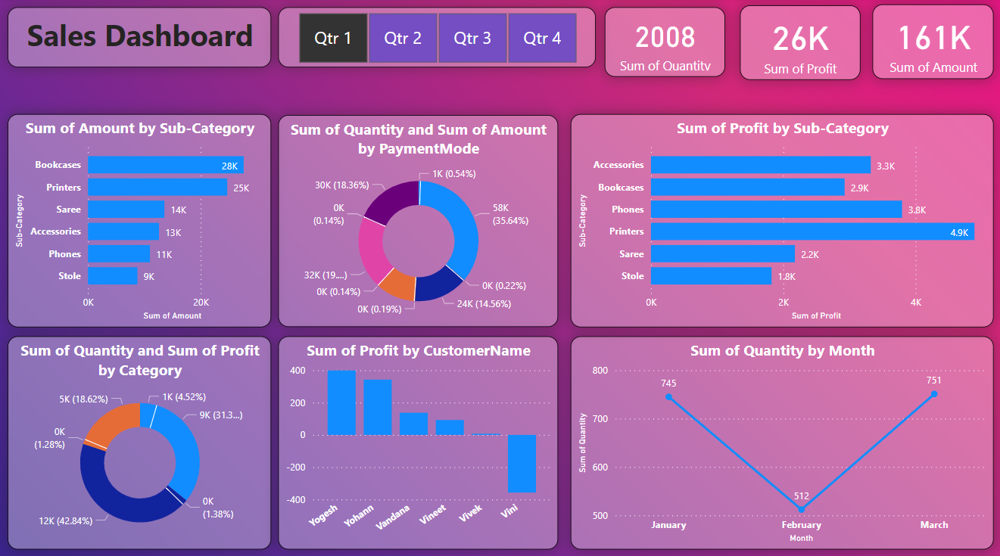

# Shop Sales Report — Power BI

## Overview
This project is an interactive **Power BI** dashboard built to visualize and analyze retail sales performance for a shop. It breaks down sales, profit, and order data by **category, sub-category, state, city, and payment mode**, giving a clear picture of what's selling, where, and how customers are paying.

The report is built directly from raw order and transaction data using Power BI's data modeling and visualization tools, turning two flat CSV files into a single connected, explorable sales dashboard.

## Tools & Technologies
| Tool | Purpose |
|---|---|
| **Power BI** | Data modeling, DAX calculations, and dashboard visualization |
| **CSV / Power Query** | Raw data source and data cleaning/transformation |

## Dataset
The data is split across two related CSV files in `Datasets/`:

**`Orders.csv`** — order-level and customer information
- `Order ID`
- `Order Date`
- `CustomerName`
- `State`
- `City`

**`Details.csv`** — line-item sales details, linked to orders via `Order ID`
- `Order ID`
- `Amount`
- `Profit`
- `Quantity`
- `Category` (Clothing, Electronics, Furniture)
- `Sub-Category` (e.g. Chairs, Phones, Sarees, Printers)
- `PaymentMode` (COD, Credit Card, Debit Card, EMI, UPI)

Together, these two tables are joined on `Order ID` inside Power BI to build the full sales model — roughly **500 orders** and **1,500 order-line records** spanning **19 states** across India.

## Dashboard


The dashboard (`Sales-Dashboard-shop.pbix`) presents:
- **Total sales, profit, and quantity sold** at a glance
- **Category and sub-category breakdown** — comparing performance across Clothing, Electronics, and Furniture and their respective sub-categories
- **Geographic sales distribution** — sales and profit by state and city
- **Payment mode analysis** — how customers pay (COD, Credit Card, Debit Card, EMI, UPI) and how that relates to sales volume
- **Order trends over time** based on order date

It's designed as a single-page, at-a-glance report that lets a shop owner or stakeholder quickly identify top-performing categories, regions, and payment preferences without digging through raw spreadsheets.

## Key Use Cases
- Identify which **product categories and sub-categories** drive the most revenue and profit
- Spot **underperforming categories** (e.g. low or negative profit lines) that may need pricing or inventory review
- Understand **regional demand** to guide stocking and marketing decisions by state/city
- See which **payment modes** customers prefer, useful for planning checkout/payment infrastructure

## Repository Structure
```
├── README.md
├── Sales-Dashboard-shop.pbix   # Power BI report file
├── Datasets/
│   ├── Orders.csv               # Order & customer info
│   └── Details.csv              # Sales, profit, category & payment details
└── images/
    └── Sales-dashboard-shop.png # Dashboard preview screenshot
```

## How to Use
1. Clone or download this repository.
2. Open `Sales-Dashboard-shop.pbix` in [Power BI Desktop](https://powerbi.microsoft.com/desktop/).
3. If prompted, point the data source connections to the `Datasets/` folder in this repo.
4. Explore the report — filter by category, state, or payment mode to drill into specific segments.
